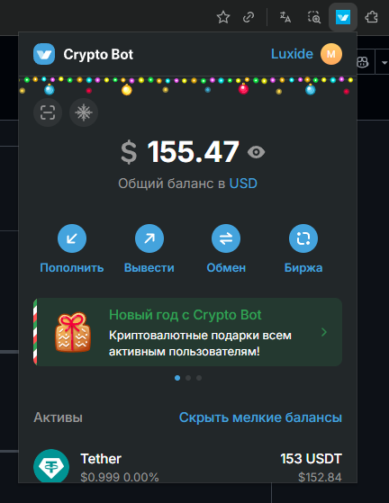

# Crypto Bot Extension

Расширение для браузеров на базе Chromium, которое открывает мини приложение Crypto Bot.

## Установка

1. Откройте браузер Chrome/Edge/Opera и перейдите в настройки расширений:
   - Chrome: `chrome://extensions/`
   - Edge: `edge://extensions/`
   - Opera: `opera://extensions/`

2. Включите "Режим разработчика" (Developer mode)

3. Нажмите "Загрузить распакованное расширение" (Load unpacked)

4. Выберите папку с файлами расширения

5. Расширение появится в панели инструментов браузера

## Использование

Нажмите на иконку расширения в панели инструментов - откроется окно с интерфейсом.

## Файлы

- `manifest.json` - манифест расширения
- `popup.html` - HTML-страница с iframe
- `README.md` - инструкции